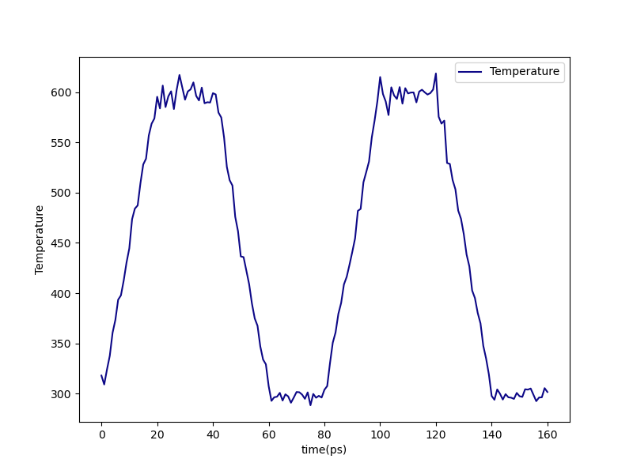
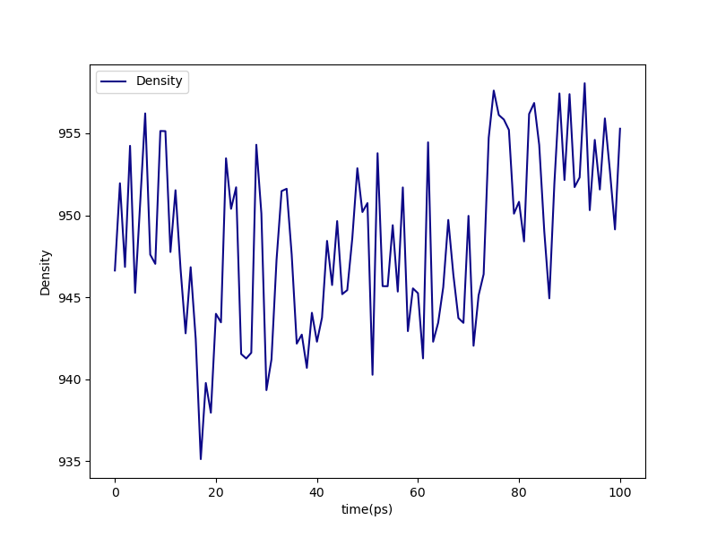

.. _pms_results:

Results
-------

Overall behavior
^^^^^^^^^^^^^^^^

Using ``htpolynet plots`` we can generate a few interesting graphics that help characterize a build.  In this tutorial, we generated a low-cure build under ``proj-0`` and a high-cure build under ``proj-1``.  Diagnostic output for each run is in ``diagnostics-lo.log`` and ``diagnostics-hi.log``, respectively.

First, we can make plots of the conversion vs. run time and the cure iteration vs. run time:

.. code-block:: console

    $ htpolynet plots -logs diagnostics-*.log

This generates ``cure-info.png``: 

.. image:: pics/cure-info.png 

We can see here that the 95\% cure took about 8 and a half minutes of run time (which is not really impressive since this is a **very** small system).  Fully two-thirds of the run time is consumed realizing the final 15\% of the cure.

Second, we can make plots that track the temperature and density throughout the entire build process:

.. code-block:: console

    $ htpolynet plots -proj proj-0

From these traces, we can see how little MD time is actually devoted to forming the bonds as compared to relaxing both before and after.  The top two plots show temperature in K vs. time in ps througout the build process.  Vertical lines denote transitions from one step to the next; transitions are very close together in time during the CURE iterations since I'm showing one transition for each drag/relax stage.  The bottom two plots show density in kg/m^3 vs time in ps.  The second and fourth plots "zoom in" on just the CURE iterations (though the zoom is not quite so big).

In the figure below, we show two renderings of this system.  In each, all bonds between C1 and C2 atoms are shown as grey tubes, and all other bonds are colored by individual unique monomer and made transparent.  On the left is the system just after the precure anneal, where you can see that only **intramolecular** C1 and C2 bonds exist.  On the right is the system after postcure, where you can see chains of -C1-C2- bonds.

.. list-table:: 

    * - .. figure:: pics/hi-pre.png

           System before cure.

      - .. figure:: pics/hi.png

           System after cure.

Details
^^^^^^^

The first ``htpolynet run`` invocation in ``run.sh`` runs the low-cure build (50\% conversion) in the ``proj-0`` project directory, and the second runs the high-cure build (95\% conversion) in the ``proj-1`` subdirectory.  Let's look at the results for the high-cure run:

.. code-block:: console

    $ cd proj-1
    $ ls
    checkpoint_state.yaml  molecules/  plots/  systems/
    $

The ``yaml`` file is just a checkpoint.  We will consider how to use checkpoints in a separate section.  There are three main subdirectories in all project directories:

* ``molecules/``: This directory has one subdirectory, ``molecules/parameterized`` that contains all files associated with generation and parameterization of all molecules and oligomer templates.  The important files here are those with ``gro``, ``top``, ``itr``, and ``grx`` extensions.

* ``systems/``:  This directory contains all directories where Gromacs runs are conducted.

* ``plots/``: This directory contains some plots generated on the fly.

``proj-1/systems``
~~~~~~~~~~~~~~~~~~

.. code-block:: console

    $ cd systems
    $ ls
    capping/  densification/  final-results/  init/  iter-1/  iter-2/  postcure/  precure/

The ``init/`` directory is where the initial topology and coordinates are generated.  Then in ``densification`` are the files associated with the MD simulations used to densify the initial system.  Next comes the ``precure`` directory, which contains all the results of the precure equilibrations and annealing (if requested).  Next come the iteration directories; here, only two CURE iterations were run (remember the console ouput?) so we see only ``iter-1`` and ``iter-2``.  Then comes the ``capping`` directory where the final topology updates are performed to cap any unreacted monomers (reverting them from their "active" forms to their "proper" forms).  Then comes ``postcure`` equilibration and relaxation.  Finally, in ``final-results`` are the ``top``, ``gro``, and ``grx`` files of the final system.

``proj-1/plots``
~~~~~~~~~~~~~~~~

``HTPolyNet`` generates several plots on the fly during a system build.  

.. code-block:: console

    $ cd ../plots
    $ ls -1
    densification-density.png
    iter-1-cure_equilibrate-density.png
    iter-2-cure_equilibrate-density.png
    iter-3-cure_equilibrate-density.png
    iter-4-cure_equilibrate-density.png
    iter-5-cure_equilibrate-density.png
    iter-6-cure_equilibrate-density.png
    iter-7-cure_equilibrate-density.png
    iter-8-cure_equilibrate-density.png
    iter-9-cure_equilibrate-density.png
    postcure-anneal-T.png
    postcure-postequilibration-density.png
    precure-anneal-T.png
    precure-postequilibration-density.png
    precure-preequilibration-density.png

For example, ``densification-density.png`` indicates that the densification simulation was in fact able to densify the system:

.. figure:: pics/densification-density.png

    ``densification-density.png`` for the high-cure build of polymethylstyrene.

We can check that the annealing cycles were correctly performed from either ``precure-anneal-T.png`` or ``postcure-anneal-T.png``:

    ``postcure-anneal-T.png``

Finally, we can take a look at the density after the postcure-anneal in ``postcure-postequilibration-density.png``:

    ``postcure-postequilibration-density.png``

Note that the final equilibrated density is about 950 kg/m^3 at 300 K and 1 bar, quite a bit higher than the density of about 800 kb/m^3 liquid styrene at 10 bar and 300 K from the densification simulations.  This result is outside the range expected for `poly(4-methyl styrene) <https://polymerdatabase.com/polymers/poly4-methylstyrene.html>`_ of about 1.01 g/cc, but it's not too suprising given that this is a very small system with a low molecular weight, and it was not very extensively equilibrated. 