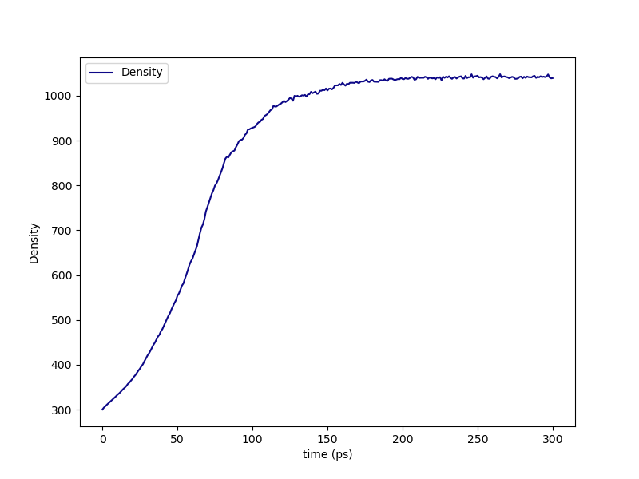

.. _dgeba_pacm_results:

Results
-------

The :ref:`results section of the PMS tutorial <pms_results>` does a good job walking you through the project directory structure for any ``HTPolyNet`` run, so we'll skip that here.  

First, if we look in either ``proj-0/plots`` (lo-cure) or ``proj-1/plots`` (hi-cure), we can see the density vs. time of the densification stage:

    Density vs. time during the densification stage of the DGEBA/PACM liquid.

