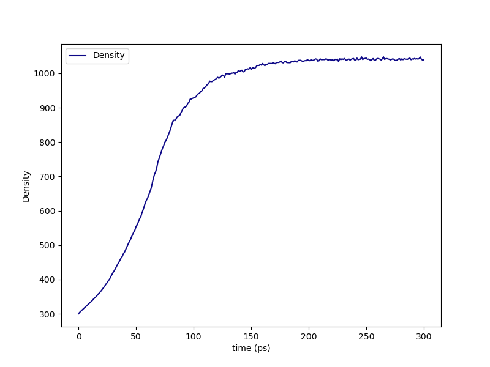
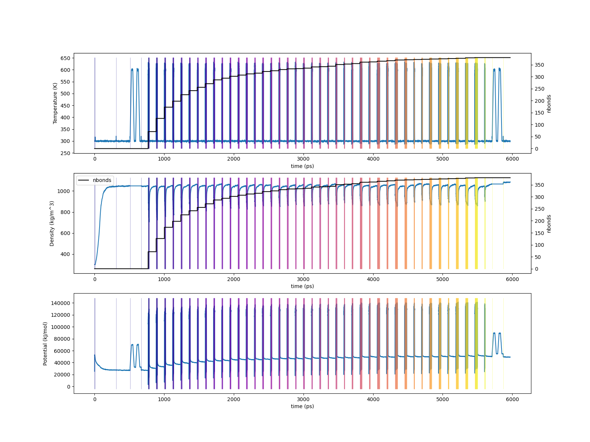

.. _dgeba_results:

Results
-------

The :ref:`results section of the PMS tutorial <pms_results>` does a good job walking you through the project directory structure for any ``HTPolyNet`` run, so we'll skip that here.  

First, if we look in either ``proj-0/plots`` (lo-cure) or ``proj-1/plots`` (hi-cure), we can see the density vs. time of the densification stage:

    Density vs. time during the densification stage of the DGEBA/PACM liquid.

By using the ``plots`` subcommand, we can generate traces of temperature, density, and potential energy vs time for the entire course of the system build:

.. code-block:: console

    $ htpolynet plots -proj proj-1 -t p1-traces.png -o p1-traces.csv
    

    (Top) Temperature vs. time for 95% cure of DGEBA/PACM; (Middle) Density vs time.  The two topmost plots also report number of bonds; (Bottom) Potential energy vs. time.

Below we show before and after pictures of the system, where all bonds associated with crosslink sites are rendered in "licorice" with the rest in lines, and DGEBA molecules are mauve while PACMs are green:

.. list-table:: 

    * - .. figure:: pics/dge-pac-liq.png

           System before cure.

      - .. figure:: pics/dge-pac-cured.png

           System after cure.