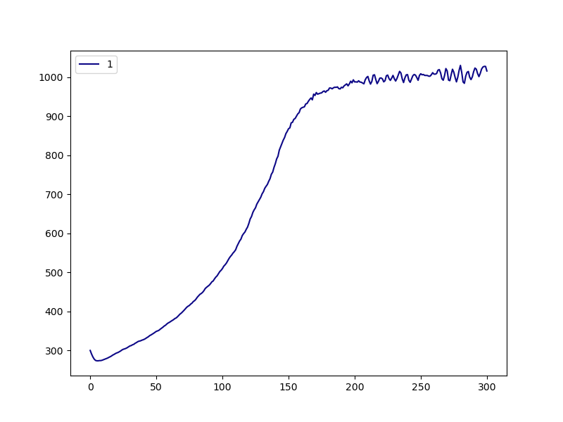

.. _dgeba_run:

Running the Build
=================

Now, in our working directory ``my_dgeba_pacm_build``, we are ready to launch HTPolyNet:

.. code-block:: console

    $ cd my_dgeba_pacm_build
    $ ls 
    DGE-PAC.yaml  lib/
    $ htpolynet run DGE-PAC.yaml -lib lib -log my_build.log --loglevel debug &
    [1]
    $ ls
    DGE-PAC.yaml  my_build.log  lib/  proj-0/
    $

HTPolyNet is instructed here to use the local ``./lib/`` as the molecule library; not including a value for ``-lib`` forces HTPolyNet to use the system library in the ``Library`` subpackage, and if you are making new molecules, they won't be there.  It is also instructed to write logging messages to ``my_build.log`` at the ``debug`` (most informative) level.  The build can take several hours, so we are running it in the background.  All the action is happening in ``proj-0`` (and of course being reportedon in ``my_build.log``), so let's look in there.  

Parameterization results
^^^^^^^^^^^^^^^^^^^^^^^^

The first major block of calculations involves parameterizing all required molecular templates.  So after a few minutes, we can inspect the parameterization results while the build continues:

.. code-block:: console

    $ cd proj-0
    $ ls
    molecules/  plots/  systems/
    $ cd molecules/parameterized
    $ ls DGE*.gro
    DGEC-1.gro  DGEC.gro  DGE.gro  DGE-SC-0-1.gro  DGE-SC-1-0.gro  DGE-SC-1-1.gro
    $

What are we seeing here?  These are the ``gro`` files generated by ``antechamber-parmchk2-tleap-parmed`` processing for the original DGEBA molecule in ``DGE.mol2``, the oxirane-regenerated molecules ``DGEC`` (C1 bonds to O1) and ``DGEC-1`` (C2 bonds to O2), and the three stereoisomers of the original DGEBA structure, called  ``DGE-SC-0-1.gro`` etc.  Notice that ``DGEC`` was the product in the explicit ``Oxirane-generation`` reaction dictionary; ``DGEC-1`` is generated by the symmetry-equivalent reaction.  Each of ``DGEC-1.gro``, ``DGEC.gro``, and ``DGE.gro`` also have companion ``mol2``, ``top``, ``itp``, and ``sea`` files.  The ``mol2``'s are generated by ``antechamber`` and can be considered "intermediates" in the parameterization process.  The original input ``mol2`` files in the ``lib/molecules/inputs/`` directory remain untouched.  The ``top`` and ``itp`` files are Gromacs-specific topology files, of course.  The ``sea`` files are atom-indexed listings of symmetry-set indices; most are -1 but atoms identified as belonging to the same symmetry sets are given unique set-specific values for this attribute.  The stereoisomer ``gro`` files don't need their own topology files.  But there is a lot more in this directory:

.. code-block:: console

    $ ls PAC*gro
    PACDGE-1.gro  PACDGE2-1.gro  PACDGE2-2.gro  PACDGE2-3.gro  PACDGE2-4.gro  
    PACDGE2-5.gro  PACDGE2-6.gro  PACDGE2-7.gro  PACDGE-2.gro  PACDGE2.gro  
    PACDGE-3.gro  PACDGE.gro  PAC.gro  PAC-SC-0-1.gro  PAC-SC-1-0.gro  
    PAC-SC-1-1.gro
    $

First, note the ``gro`` files for ``PAC`` and its three stereoisomers.  You can also see ``gro`` files for ``PACDGE``, ``PACDGE-1``, ``PACDGE-2``, and ``PACDGE-3``; ``PACDGE`` is the product of the explicit ``Primary-to-seconary-amine`` reaction dictionary, but what are these other three?  These are the results of so-called "symmetry-expansion" of the original reaction based on the symmetry-equivalent atom declaraions. The first, ``PACDGE``, results from N1 of PACM bonding to C1 of DGEBA.  Since N1 is symmetric to N2 and C1 to C2, then the other three products are the result of N1-C2 (``PACDGE-1``), N2-C1 (``PACDGE-2``), and N2-C2 (``PACDGE-3``) bonds, respectively.  These are automatically enumerated by HTPolyNet because of the symmetry declarations.

You also see a ``gro`` file for ``PACDGE2``, and then for seven other symmetry partners ``PACDGE2-1`` to ``PACDGE2-7``.  Why are there **eight** distinct tertiary amine products?  The baseline product ``PACDGE2`` is formed by reacting the N1 of ``PACDGE`` to the C1 of ``DGE``, but remember that ``PACDGE`` is formed by the reaction of N1 of ``PAC`` and C1 of a **different** ``DGE``.  So the "sequence" of the product is ``PAC`` - ``DGE`` - ``DGE`` and each has a reactive atom in a symmetry set of size two; three slots with two possibilities in each is 2\ :sup:`3` = 8 realizations.  Each of these also have their own companion ``mol2``, ``top``, ``itp``, and ``sea`` files.

Liquid generation and densification
^^^^^^^^^^^^^^^^^^^^^^^^^^^^^^^^^^^

After a few more minutes, when the densification MD simulation has finished, let's back out of the ``molecules/parameterized/`` subdirectory and drop into ``systems/init/``:

.. code-block:: console

    $ cd ../../systems/init
    $ ls -1
    DGE.gro
    DGE-SC-0-1.gro
    DGE-SC-1-0.gro
    DGE-SC-1-1.gro
    gmx.in
    init.gro
    init.grx
    init-minimized.edr
    init-minimized.gro
    init-minimized.log
    init-minimized.tpr
    init-minimized.trr
    init.top
    liquid-densify-npt.mdp
    mdout.mdp
    minimize.mdp
    npt-1.cpt
    npt-1-density.xvg
    npt-1.edr
    npt-1.gro
    npt-1.log
    npt-1-out.xvg
    npt-1.tpr
    npt-1.trr
    PAC.gro
    PAC-SC-0-1.gro
    PAC-SC-1-0.gro
    PAC-SC-1-1.gro
    $

The ``PAC`` and ``DGE`` ``gro`` files are used by ``gmx insert-molecules`` to build the initial coordinates, which appear in ``init.gro``.  HTPolyNet built the initial topology ``init.top`` using the template topologies, and ``init.grx`` (a "Gromacs-extended" coordinate file) contains some additional atomic attributes HTPolyNet needs.  The ``mdp`` file ``minimize.mdp`` is "checked-out" from the system library and combined with ``init.top`` and ``init.gro`` via ``gmx grompp`` to build the ``mdrun`` input ``init-minimized.tpr``.  The results of that minimization are all the ``init-minimized`` files.  Densification is governed by the ``liquid-densify-npt.mdp`` file, also checked-out from the system library.  The densification results are all in the ``npt-1`` files.  The set ``init.top``, ``init.grx``, and ``npt-1.gro`` together constitute the "densified" state of the liquid system, and these are what initiates the CURE iterations to follow.

However, first a little detour:  let's go up out of ``systems/init`` and into ``plots/``:

.. code-block:: console

    $ cd ../../plots
    $ ls
    init-density.png

HTPolyNet automatically generates a plot of density vs. time for the densification simulation:

We can see that we've successfully arrived at the liquid-like density of about 1,000 kg/m\ :sup:`3`.

The first CURE iteration
^^^^^^^^^^^^^^^^^^^^^^^^

The next major part of the build is the first CURE iteration, which is the most expensive because the pair searching is most demanding when the number of reactive atoms is maximal.  So let's back out of ``plots`` and drop into ``systems/iter-1``.  For a long time (maybe an hour or so), all you will see is:

.. code-block:: console

    $ cd ../systems/iter-1
    $ ls
    linkcell-0.50.grx

That is an auxiliary file storing a link-cell index for each relevant atom (HTPolyNet uses a link-cell algorithm to perform the bond searching).  However, once the bond search is complete and we've entered the relaxation stages, we'll see:

Subsequent CURE iterations
^^^^^^^^^^^^^^^^^^^^^^^^^^

Post-cure reactions
^^^^^^^^^^^^^^^^^^^

Equilibration and finalization
^^^^^^^^^^^^^^^^^^^^^^^^^^^^^^