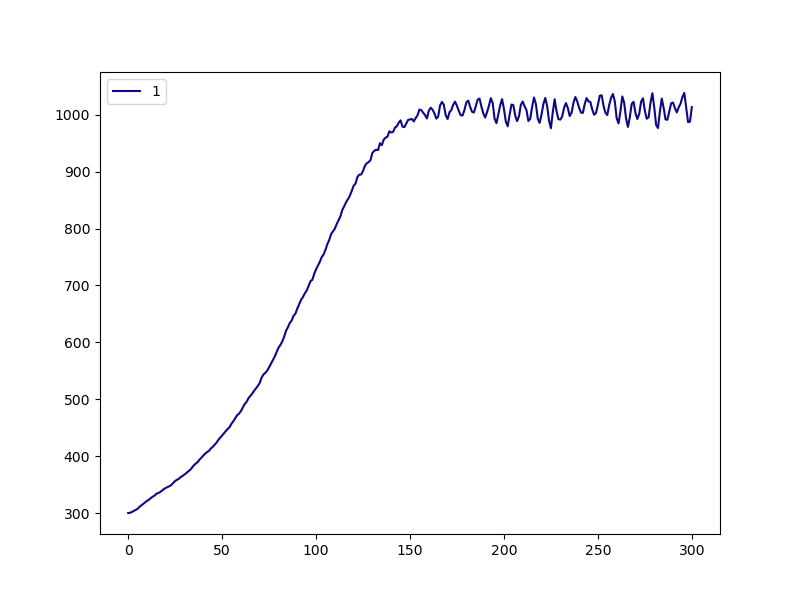
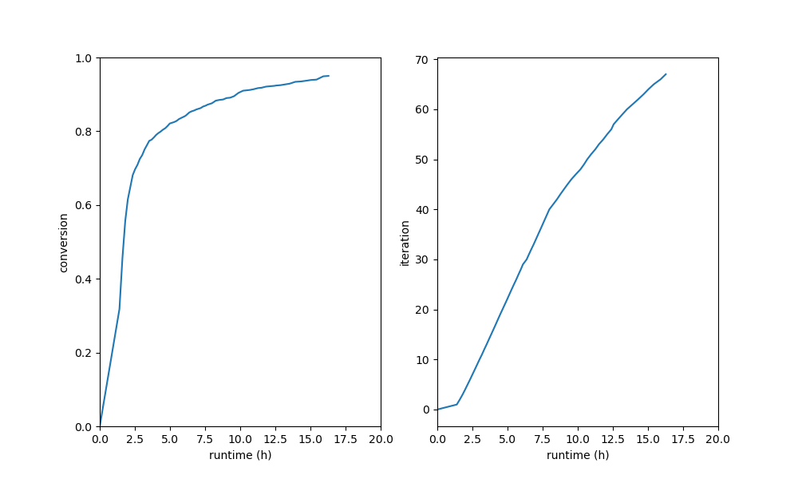

.. _dgeba_run:

Running the Build
=================

Now, in our working directory ``my_dgeba_pacm_build``, we are ready to launch HTPolyNet:

.. code-block:: console

    $ cd my_dgeba_pacm_build
    $ ls 
    DGE-PAC.yaml  lib/
    $ htpolynet run DGE-PAC.yaml -lib lib -log my_build.log --loglevel debug &
    [1]
    $ ls
    DGE-PAC.yaml  my_build.log  lib/  proj-0/
    $

HTPolyNet is instructed here to use the local ``./lib/`` as the molecule library; not including a value for ``-lib`` forces HTPolyNet to use the system library in the ``Library`` subpackage, and if you are making new molecules, they won't be there.  It is also instructed to write logging messages to ``my_build.log`` at the ``debug`` (most informative) level.  The build can take several hours, so we are running it in the background.  All the action is happening in ``proj-0`` (and of course being reportedon in ``my_build.log``), so let's look in there.  

Parameterization results
^^^^^^^^^^^^^^^^^^^^^^^^

The first major block of calculations involves parameterizing all required molecular templates.  So after a few minutes, we can inspect the parameterization results while the build continues:

.. code-block:: console

    $ cd proj-0
    $ ls
    molecules/  plots/  systems/
    $ cd molecules/parameterized
    $ ls DGE*.gro
    DGEC-1.gro  DGEC.gro  DGE.gro  DGE-SC-0-1.gro  DGE-SC-1-0.gro  DGE-SC-1-1.gro
    $

What are we seeing here?  These are the ``gro`` files generated by ``antechamber-parmchk2-tleap-parmed`` processing for the original DGEBA molecule in ``DGE.mol2``, the oxirane-regenerated molecules ``DGEC`` (C1 bonds to O1) and ``DGEC-1`` (C2 bonds to O2), and the three stereoisomers of the original DGEBA structure, called  ``DGE-SC-0-1.gro`` etc.  Notice that ``DGEC`` was the product in the explicit ``Oxirane-generation`` reaction dictionary; ``DGEC-1`` is generated by the symmetry-equivalent reaction.  Each of ``DGEC-1.gro``, ``DGEC.gro``, and ``DGE.gro`` also have companion ``mol2``, ``top``, ``itp``, and ``sea`` files.  The ``mol2``'s are generated by ``antechamber`` and can be considered "intermediates" in the parameterization process.  The original input ``mol2`` files in the ``lib/molecules/inputs/`` directory remain untouched.  The ``top`` and ``itp`` files are Gromacs-specific topology files, of course.  The ``sea`` files are atom-indexed listings of symmetry-set indices; most are -1 but atoms identified as belonging to the same symmetry sets are given unique set-specific values for this attribute.  The stereoisomer ``gro`` files don't need their own topology files.  But there is a lot more in this directory:

.. code-block:: console

    $ ls PAC*gro
    PACDGE-1.gro  PACDGE2-1.gro  PACDGE2-2.gro  PACDGE2-3.gro  PACDGE2-4.gro  
    PACDGE2-5.gro  PACDGE2-6.gro  PACDGE2-7.gro  PACDGE-2.gro  PACDGE2.gro  
    PACDGE-3.gro  PACDGE.gro  PAC.gro  PAC-SC-0-1.gro  PAC-SC-1-0.gro  
    PAC-SC-1-1.gro
    $

First, note the ``gro`` files for ``PAC`` and its three stereoisomers.  You can also see ``gro`` files for ``PACDGE``, ``PACDGE-1``, ``PACDGE-2``, and ``PACDGE-3``; ``PACDGE`` is the product of the explicit ``Primary-to-seconary-amine`` reaction dictionary, but what are these other three?  These are the results of so-called "symmetry-expansion" of the original reaction based on the symmetry-equivalent atom declaraions. The first, ``PACDGE``, results from N1 of PACM bonding to C1 of DGEBA.  Since N1 is symmetric to N2 and C1 to C2, then the other three products are the result of N1-C2 (``PACDGE-1``), N2-C1 (``PACDGE-2``), and N2-C2 (``PACDGE-3``) bonds, respectively.  These are automatically enumerated by HTPolyNet because of the symmetry declarations.

You also see a ``gro`` file for ``PACDGE2``, and then for seven other symmetry partners ``PACDGE2-1`` to ``PACDGE2-7``.  Why are there **eight** distinct tertiary amine products?  The baseline product ``PACDGE2`` is formed by reacting the N1 of ``PACDGE`` to the C1 of ``DGE``, but remember that ``PACDGE`` is formed by the reaction of N1 of ``PAC`` and C1 of a **different** ``DGE``.  So the "sequence" of the product is ``PAC`` - ``DGE`` - ``DGE`` and each has a reactive atom in a symmetry set of size two; three slots with two possibilities in each is 2\ :sup:`3` = 8 realizations.  Each of these also have their own companion ``mol2``, ``top``, ``itp``, and ``sea`` files.

Liquid generation and densification
^^^^^^^^^^^^^^^^^^^^^^^^^^^^^^^^^^^

After a few more minutes, when the densification MD simulation has finished, let's back out of the ``molecules/parameterized/`` subdirectory and drop into ``systems/init/``:

.. code-block:: console

    $ cd ../../systems/init
    $ ls -1
    DGE.gro
    DGE-SC-0-1.gro
    DGE-SC-1-0.gro
    DGE-SC-1-1.gro
    gmx.in
    init.gro
    init.grx
    init-minimized.edr
    init-minimized.gro
    init-minimized.log
    init-minimized.tpr
    init-minimized.trr
    init.top
    liquid-densify-npt.mdp
    mdout.mdp
    minimize.mdp
    npt-1.cpt
    npt-1-density.xvg
    npt-1.edr
    npt-1.gro
    npt-1.log
    npt-1-out.xvg
    npt-1.tpr
    npt-1.trr
    PAC.gro
    PAC-SC-0-1.gro
    PAC-SC-1-0.gro
    PAC-SC-1-1.gro
    $

The ``PAC`` and ``DGE`` ``gro`` files are used by ``gmx insert-molecules`` to build the initial coordinates of the low-density system, which appear in ``init.gro``.  HTPolyNet built the initial topology ``init.top`` using the template topologies, and ``init.grx`` (a "Gromacs-extended" coordinate file) contains some additional atomic attributes HTPolyNet needs.  The ``mdp`` file ``minimize.mdp`` is "checked-out" from the system library and combined with ``init.top`` and ``init.gro`` via ``gmx grompp`` to build the ``mdrun`` input ``init-minimized.tpr``.  The results of that minimization are all the ``init-minimized`` files.  Densification is governed by the ``liquid-densify-npt.mdp`` file, also checked-out from the system library.  The densification results are all in the ``npt-1`` files.  The set ``init.top``, ``init.grx``, and ``npt-1.gro`` together constitute the "densified" state of the liquid system, and these are what initiates the CURE iterations to follow.

However, first a little detour:  let's go up out of ``systems/init`` and into ``plots/``:

.. code-block:: console

    $ cd ../../plots
    $ ls
    init-density.png

HTPolyNet automatically generates a plot of density vs. time for the densification simulation:

We can see that we've successfully arrived at the liquid-like density of about 1,000 kg/m\ :sup:`3`.

The first CURE iteration
^^^^^^^^^^^^^^^^^^^^^^^^

The next major part of the build is the first CURE iteration, which is the most expensive because the pair searching is most demanding when the number of reactive atoms is maximal.  So let's back out of ``plots`` and drop into ``systems/iter-1``.  For a long time (maybe an hour or so), all you will see is:

.. code-block:: console

    $ cd ../systems/iter-1
    $ ls
    linkcell-0.50.grx

That is an auxiliary file storing a link-cell index for each relevant atom (HTPolyNet uses a link-cell algorithm to perform the bond searching).  However, once the bond search is complete and any dragging or relaxation is done, we'll see a large number of files.  They can be divided into seven "phases":

0. Bondsearch system
1. Dragging
2. Topology update
3. Relaxation
4. Equilibration
5. Finalization
6. Auxiliary files

Names of files corresponding to states 0-5 all begin with their respective digits.  Names of files that do not begin with a digit are "auxiliary".  Let's consider the files in the seven states.

Bondsearch files
----------------

Files associated with the bondsearch begin with ``0``:

.. code-block:: console

    $ ls -1 0-*
    0-bondsearch-bonds.csv
    0-bondsearch.gro
    0-bondsearch.grx
    0-bondsearch-input.gro
    0-bondsearch.top

The ``gro`` and ``top`` files are sufficient Gromacs input.  The ``grx`` file contains values of four extra attributes for each atom:

.. code-block:: console

    $ head 0-bondsearch-bonds.csv
    globalIdx  z  cycle-idx reactantName
            1  0          1          PAC
            2  0          1          PAC
            3  0          1          PAC
            4  0          1          PAC
            5  0          1          PAC
            6  0          1          PAC
            7  0          0          PAC
            8  0          2          PAC
            9  0          2          PAC

``globalIdx`` corresponds to the ``nr`` attribute in the ``[ atoms ]`` directive of a ``top`` file, or the ``atomNum`` attribute of a ``gro`` file; it is just the global atom index.  ``z`` is the current value of the number of available crosslink bonds for that atom.  ``cycle-idx`` are unique indices indicated which ring the atom belongs to; rings are labeled uniquely within a residue.  Finally, ``reactantName`` is initialized as the residue name the atom belongs to.  However, as we will see, this attribute is key for communicating which product template maps onto a set of particular residues that react.

The ``csv`` file is a dump of the bonds "DataFrame":

.. code-block:: console

    $ head 0-bondsearch-bonds.csv 
    ai aj reactantName initial-distance
    302 32058 PACDGE-3 0.3069770155891144
    6493 15193 PACDGE-2 0.311919861502919
    5221 30828 PACDGE 0.32043593447052693
    6738 17218 PACDGE-1 0.3201905682558434
    3294 18331 PACDGE-1 0.32241122809232253
    5427 29662 PACDGE-2 0.32537209468545386
    7066 16423 PACDGE-1 0.32753053002735405
    5140 18585 PACDGE-2 0.3265669915959048
    9895 26970 PACDGE-1 0.3313744105992492

The first two columns are pre-bond global atom indices for each bond-designate; the third column is the name of the product molecule template of the reaction type that forms this bond, and the fourth column is the instantaneous interatomic distance in nm.  This is the first real output of the bond search.  Later, in the "connect" stage, atoms listed here will inherit their ``reactantName`` from this structure.

Dragging files
--------------

Files associated with prebond dragging begin with ``1``.  However, because no bond-designate length exceeded 0.5 nm, no dragging is triggered.  So the build proceeds to topology update.

Topology update files
---------------------

Files associated with the topology update process begin with a ``2``:

.. code-block:: console

    $ ls -1 2*
    2-update-complete-bonds.csv
    2-update-complete.gro
    2-update-complete.grx
    2-update-complete.top
    2-update-idx-mapper.dat
    2-update-resid-graph.json

All files here represent outputs of the topology update.  Let's look at the ``2-update-idx-mapper.dat``:

.. code-block:: console

    $ tail 2-update-idx-mapper.dat 
    36741 36105
    36742 36106
    36743 36107
    36744 36108
    36745 36109
    36746 36110
    36747 36111
    36748 36112
    36749 36113
    36750 36114

The purpose of this file is very simple:  The first column are atom indices **before** topology update, and the second column are indices **after** topology update.  Remember that topology updating deletes sacrificial hydrogens, which means atoms are reindexed.  This file allows is to match any atoms in pre-update ``gro`` and ``top`` files to those that exist downstream of a topology update.  Note that I've chosen to show a ``tail`` of this file to highlight the largest index differences.  The post-update indexes also appear in the ``csv`` file showing all bonds.

Again, the ``gro`` and ``top`` are proper Gromacs inputs, and the ``grx`` file tabulates all ``z``, ``cycle-idx``, and ``reactantName`` attributes.  The ``json`` file represents the graph structure of the network on a resid basis in JSON format.

Relaxation files
----------------

Files that begin with a ``3`` correspond to bond relaxation stages.  In this example, six stages are run by virture of the bond-designate with the longest bond length (0.499 nm) and the ``relax_increment`` of 0.075 nm.  Each stage produces 22 output files: the bonds ``csv``, the ``gro`` / ``grx`` / ``top`` that initializes the first stage, and then the 17 **outputs** from the minimization (5), nvt (6), and npt (6) sub-stages:

.. code-block:: console

    $ ls 3-*
    3-relax-stage-1-bonds.csv
    3-relax-stage-1.gro
    3-relax-stage-1.grx
    3-relax-stage-1-min.edr
    3-relax-stage-1-min.gro
    3-relax-stage-1-min.log
    3-relax-stage-1-min.tpr
    3-relax-stage-1-min.trr
    3-relax-stage-1-npt.cpt
    3-relax-stage-1-npt.edr
    3-relax-stage-1-npt.gro
    3-relax-stage-1-npt.log
    3-relax-stage-1-npt.tpr
    3-relax-stage-1-npt.trr
    3-relax-stage-1-nvt.cpt
    3-relax-stage-1-nvt.edr
    3-relax-stage-1-nvt.gro
    3-relax-stage-1-nvt.log
    3-relax-stage-1-nvt.tpr
    3-relax-stage-1-nvt.trr
    3-relax-stage-1.top
    ...
    3-relax-stage-6-bonds.csv
    3-relax-stage-6.gro
    3-relax-stage-6.grx
    3-relax-stage-6-min.edr
    3-relax-stage-6-min.gro
    3-relax-stage-6-min.log
    3-relax-stage-6-min.tpr
    3-relax-stage-6-min.trr
    3-relax-stage-6-npt.cpt
    3-relax-stage-6-npt.edr
    3-relax-stage-6-npt.gro
    3-relax-stage-6-npt.log
    3-relax-stage-6-npt.tpr
    3-relax-stage-6-npt.trr
    3-relax-stage-6-nvt.cpt
    3-relax-stage-6-nvt.edr
    3-relax-stage-6-nvt.gro
    3-relax-stage-6-nvt.log
    3-relax-stage-6-nvt.tpr
    3-relax-stage-6-nvt.trr
    3-relax-stage-6.top

The attenuation is managed by the sequential ``top`` files.  Let's look at the entry for a particular bond (between atoms 8754 and 32687) in each stage's ``top`` file's ``[ bonds ]`` directive:

.. code-block:: console

    $ grep "^8754 32687" 3-relax-stage-?.top|awk '{if ($3==1) print $0}'
    3-relax-stage-1.top:8754 32687 1 0.4395036912695118 45452.18666666666
    3-relax-stage-2.top:8754 32687 1 0.38089695301560944 90904.37333333332
    3-relax-stage-3.top:8754 32687 1 0.32229021476170705 136356.56
    3-relax-stage-4.top:8754 32687 1 0.2636834765078047 181808.74666666664
    3-relax-stage-5.top:8754 32687 1 0.20507673825390232 227260.93333333335
    3-relax-stage-6.top:8754 32687 1 0.14647 272713.12
    $

In a ``[ bonds ]`` topology directive, the 4th and 5th columns are ``b0`` and ``kt`` harmonic bond parameters.  In the stage-6 ``top``, we see these parameters at their proper force-field values for a C-N single bond.  Notice how the value of the distance parameter ``b0`` begins at a large initial value and linearly decreases toward the target (but never by *more* than an increment of 0.075 nm), while the spring constant ``kt`` starts low and increases linearly toward its target.  

Equilibration files
-------------------

Files associated with final equilibration of the bonded system at the end of one CURE iteration begin with a ``4``:

.. code-block:: console

    $ ls 4-*
    4-equilibrate-bonds.csv
    4-equilibrate-complete-bonds.csv
    4-equilibrate-complete.gro
    4-equilibrate-complete.grx
    4-equilibrate-complete.top
    4-equilibrate.gro
    4-equilibrate.grx
    4-equilibrate.mdp
    4-equilibrate-post.cpt
    4-equilibrate-post.edr
    4-equilibrate-post.gro
    4-equilibrate-post.log
    4-equilibrate-post.tpr
    4-equilibrate-post.trr
    4-equilibrate.top

Files with the simple prefix ``4-equilibrate`` represent inputs to the Gromacs run.  Files with the prefixs ``4-equilibrate-post`` are the raw Gromacs mdrun outputs, and the files with the prefix ``4-equilibrate-complete`` represent the Gromacs outputs read back in to HTPolyNet and processed.  This set of ``complete`` files are copied to the next CURE iteration directory as the set of ``0-connect`` files.

Subsequent CURE iterations
^^^^^^^^^^^^^^^^^^^^^^^^^^

The number of CURE iterations needed to reach the specified conversion (0.95) is never deterministic because of the randomness inherent in the inter-stage and post-bonding MD simulations.  In this particular instance, a total of 67 CURE iterations were required to reach 0.95.  Below are two plots that illustrate this process

Post-cure reactions
^^^^^^^^^^^^^^^^^^^

Equilibration and finalization
^^^^^^^^^^^^^^^^^^^^^^^^^^^^^^