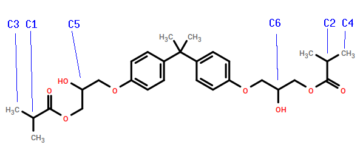
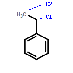

.. _ve_sty_monomers:

Monomers
========

In this section, we describe how the inputs :download:`GMA.mol2 <GMA.mol2>` and :download:`STY.mol2 <STY.mol2>` are generated for the bisGMA and styrene monomers, respectively.  Since this represents an instance where a new system is being generated, let's begin by creating an empty directory and then populating with a "molecule library":abbr:

.. code-block:: console

    $ cd 
    $ mkdir my_ve_styrene_build
    $ cd my_ve_styrene_build
    $ mkdir lib
    $ mkdir lib/molecules
    $ mkdir lib/molecules/inputs
    $ mkdir lib/molecules/parameterized
    $ cd lib/molecules/inputs

Now we can generate the two required ``*.mol2`` files.

BisGMA
^^^^^^

Bisphenol A-glycidyl methacrylate, or "BisGMA", is a crosslinking monomer that can be used in vinyl ester resin formulations.  In the structure above, we have shown the terminal double bonds as hydrogenated in accordance with our use of sacrificial hydrogens during cure.  In analogy with the poly(methyl styrene) example, we will call the radical carbon ``C1`` and its partner ``C3``; since there are two double bonds that can react in bisGMA, we will call the other radical carbon ``C2`` and its partner ``C4``.  There are four stereocenters: in the non-hydrogenated molecule, both ``C1`` and ``C2`` are chiral (even though they are not in the hydrogenated version, we must treat them as chiral since they will be if the monomer reacts!); and the two others we will term ``C5`` and ``C6``.  The following command uses the SMILES string for bisGMA as input and correctly names the important atoms:

.. code-block:: console

    $ echo "CC(C)C(=O)OCC(COC1=CC=C(C=C1)C(C)(C)C2=CC=C(C=C2)OCC(COC(=O)C(C)C)O)O" | \
      obabel -ismi -h --gen3d --title GMA -omol2 | \
      sed s/" 1 C "/" 1 C3"/ | \
      sed s/" 2 C "/" 2 C1"/ | \
      sed s/" 8 C "/" 8 C5"/ | \
      sed s/"33 C "/"33 C2"/ | \
      sed s/"34 C "/"34 C4"/ | \
      sed s/"28 C "/"28 C6"/ | \
      sed s/"UNL1   "/"GMA    "/ > GMA.mol2

Styrene
^^^^^^^

The command below generates a mol2 file for styrene in which the radical carbon is ``C1`` and its partner is ``C2``:

.. code-block:: console

    $ echo "C1=CC=CC=C1CC" | \
           obabel -ismi -omol2 -h --gen3d --title STY | \
           sed s/" 7 C "/" 7 C1"/ | \
           sed s/" 8 C "/" 8 C2"/ | \
           sed s/"UNL1   "/"STY    "/ > STY.mol2
..
    .. image:: PAC-2d.png

    `4,4-diaminodicyclohexylmethane <https://en.wikipedia.org/wiki/4,4-Diaminodicyclohexylmethane>`_, referred to colloquially as PACM ("pack-em"), is a common hardener in epoxy formulations.  Since it has two primary amine groups, it can bond to at most four distinct epoxide groups.  The SMILES string for PACM is::
        
        C1CC(CCC1CC2CCC(CC2)N)N

    Just as we did with DGEBA, we can generate a structure for the "PAC" monomer:

    .. code-block:: console

        $ echo "C1CC(CCC1CC2CCC(CC2)N)N" | \
            obabel -ismi -h --gen3d -omol2 --title "PAC" | \
            sed s/"UNL1   "/"PAC    "/ > PAC-raw.mol2

    Since we know PACM has two primary amines, we don't need to convert it to a form with sacrificial H's -- it already has them.  We do, however, need to edit ``PAC-raw.mol2`` to give unique atom names to the two amine nitrogens and the two chiral carbons to which they are attached:

    .. image:: PAC-labelled.png

    We see that the two amine nitrogens are atoms 13 and 14 in VMD numbering, which correspond respectively to atoms 14 and 15 in ``mol2`` numbering, so let's call them "N1" and "N2", respectively.  The carbon atom 11 (10 in VMD numbering) to which our "N1" is bound can now be called "C1", and the carbon atom 3 (2 in VMD) to which our "N2" is bound "C2".

    .. code-block:: console

        $ echo PAC-raw.mol2 | sed s/"14 N "/"14 N1"/ | \
                            sed s/"15 N "/"15 N1"/ | \
                            sed s/"3 C "/"3 C1"/ | \
                            sed s/"11 C "/"11 C1"/ > PAC.mol2

    Let's look at the file :download:`PAC.mol2 <PAC.mol2>` that results from the command above::

        @<TRIPOS>MOLECULE
        PAC
        41 42 0 0 0
        SMALL
        GASTEIGER

        @<TRIPOS>ATOM
            1 C           1.0203    1.1686   -0.4045 C.3     1  PAC        -0.0488
            2 C          -0.3868    1.4530    0.1332 C.3     1  PAC        -0.0375
            3 C2         -0.4239    1.5867    1.6509 C.3     1  PAC         0.0049
            4 C           0.2189    0.3673    2.3129 C.3     1  PAC        -0.0375
            5 C           1.6627    0.1840    1.8377 C.3     1  PAC        -0.0488
            6 C           1.7559    0.0170    0.3181 C.3     1  PAC        -0.0407
            7 C           3.2445   -0.0611   -0.1651 C.3     1  PAC        -0.0474
            8 C           4.0849   -1.2509    0.3999 C.3     1  PAC        -0.0407
            9 C           5.5341   -1.2664   -0.1535 C.3     1  PAC        -0.0488
            10 C           6.3098   -2.5522    0.1636 C.3     1  PAC        -0.0375
            11 C1          5.4974   -3.8029   -0.1700 C.3     1  PAC         0.0049
            12 C           4.1937   -3.8000    0.6212 C.3     1  PAC        -0.0375
            13 C           3.3524   -2.5924    0.2247 C.3     1  PAC        -0.0488
            14 N1          6.2599   -5.0172    0.1162 N.3     1  PAC        -0.3272
            15 N2         -1.8168    1.7369    2.0786 N.3     1  PAC        -0.3272
            16 H           1.6047    2.0898   -0.3424 H       1  PAC         0.0268
            17 H           0.9019    0.9202   -1.4627 H       1  PAC         0.0268
            18 H          -1.0564    0.6483   -0.1927 H       1  PAC         0.0280
            19 H          -0.7633    2.3773   -0.3343 H       1  PAC         0.0280
            20 H           0.1247    2.4885    1.9532 H       1  PAC         0.0458
            21 H          -0.3534   -0.5388    2.0744 H       1  PAC         0.0280
            22 H           0.2067    0.4761    3.4022 H       1  PAC         0.0280
            23 H           2.0776   -0.7078    2.3325 H       1  PAC         0.0268
            24 H           2.2691    1.0366    2.1678 H       1  PAC         0.0268
            25 H           1.2371   -0.9012    0.0434 H       1  PAC         0.0301
            26 H           3.7432    0.8605    0.1294 H       1  PAC         0.0271
            27 H           3.2593   -0.0975   -1.2596 H       1  PAC         0.0271
            28 H           4.1835   -1.0879    1.4730 H       1  PAC         0.0301
            29 H           6.0813   -0.4176    0.2686 H       1  PAC         0.0268
            30 H           5.5482   -1.1352   -1.2427 H       1  PAC         0.0268
            31 H           6.5982   -2.5580    1.2292 H       1  PAC         0.0280
            32 H           7.2463   -2.5515   -0.4099 H       1  PAC         0.0280
            33 H           5.2588   -3.8065   -1.2451 H       1  PAC         0.0458
            34 H           4.3975   -3.7699    1.7048 H       1  PAC         0.0280
            35 H           3.6232   -4.7131    0.4347 H       1  PAC         0.0280
            36 H           2.4417   -2.5989    0.8401 H       1  PAC         0.0268
            37 H           3.0264   -2.7222   -0.8175 H       1  PAC         0.0268
            38 H           6.5386   -5.0249    1.0976 H       1  PAC         0.1185
            39 H           7.1205   -5.0120   -0.4231 H       1  PAC         0.1185
            40 H          -2.3522    0.9246    1.7729 H       1  PAC         0.1185
            41 H          -2.2309    2.5311    1.5900 H       1  PAC         0.1185
        @<TRIPOS>BOND
            1     1     2    1
            2     2     3    1
            3     3     4    1
            4     4     5    1
            5     5     6    1
            6     1     6    1
            7     6     7    1
            8     7     8    1
            9     8     9    1
            10     9    10    1
            11    10    11    1
            12    11    12    1
            13    12    13    1
            14     8    13    1
            15    11    14    1
            16     3    15    1
            17     1    16    1
            18     1    17    1
            19     2    18    1
            20     2    19    1
            21     3    20    1
            22     4    21    1
            23     4    22    1
            24     5    23    1
            25     5    24    1
            26     6    25    1
            27     7    26    1
            28     7    27    1
            29     8    28    1
            30     9    29    1
            31     9    30    1
            32    10    31    1
            33    10    32    1
            34    11    33    1
            35    12    34    1
            36    12    35    1
            37    13    36    1
            38    13    37    1
            39    14    38    1
            40    14    39    1
            41    15    40    1
            42    15    41    1

The next thing we consider is how to create the :ref:`reaction dictionaries <ve_reaction_dictionaries>` necessary to describe the crosslinking chemistry.