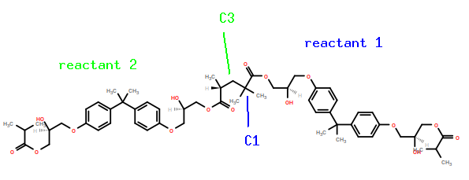
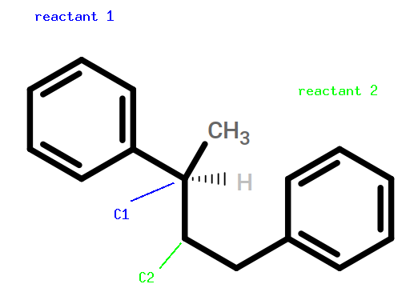
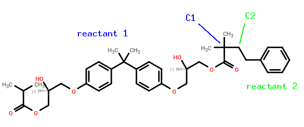
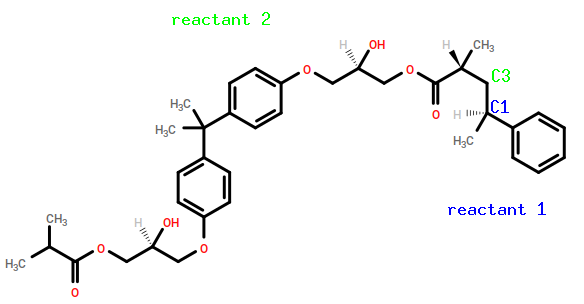

.. _ve_reaction_dictionaries:

Reactions
=========

Now that the input structures for BisGMA and styrene have been generated, we are ready to generate the reaction dictionaries that describe the chemistry.  BisGMA has two carbon-carbon double bonds, ``C1=C3`` and ``C2=C4``, and styrene has one, ``C1=C2``.  Remember that for bisGMA, we decided that ``C1`` and ``C2`` were the symmetry-equivalent radical carbons and ``C3`` and ``C4`` the symmetry-equivalent methyl carbons, while on styrene ``C1`` is the radical carbon and ``C2`` is the methyl.  

Our basic reaction model is that a radical carbon "attacks" a methyl carbon, ejecting 2 sacrifical H's and forming a single C-C bond.  We must therefore encode four basic reaction scenarios:

.. table:: Monomer-monomer reactions in the bisGMA/styrene system
    :widths: auto

    ===================  =====================
    Attacker             Attackee
    ===================  =====================
    bisGMA               bisGMA
    styrene              styrene
    bisGMA               styrene
    styrene              bisGMA
    ===================  =====================

Let's consider the two homomeric reactions first.  For bisGMA-bisGMA, we need only encode the ``C1``-attacks-``C3`` reaction, and then symmetry equivalence will be invoked to enumerate the other three possibilities.

.. code-block:: yaml

 - {
      name:        'gma~c1-c3~gma',
      stage:       cure,
      reactants:   {1: GMA, 2: GMA},
      product:     GMA~C1-C3~GMA,
      probability: 1.0,
      atoms: {
        A: {reactant: 1, resid: 1, atom: C1, z: 1},
        B: {reactant: 2, resid: 1, atom: C3, z: 1}
      },
      bonds: [
        {atoms: [A, B], order: 1}
      ]
    }

For styrene dimerization, we need only encode the ``C1``-attacks-``C2`` reaction:

.. code-block:: yaml

 - {
      name:        'sty~c1-c2~sty',
      stage:       cure,
      reactants:   {1: STY, 2: STY},
      product:     STY~C1-C2~STY,
      probability: 1.0,
      atoms: {
        A: {reactant: 1, resid: 1, atom: C1, z: 1},
        B: {reactant: 2, resid: 1, atom: C2, z: 1}
      },
      bonds: [
        {atoms: [A, B], order: 1}
      ]
    }

Then the *two* cross reactions must also be explicitly declared.  First, the ``C1``-of-bisGMA-attacks-``C2``-of-styrene:

.. code-block:: yaml

 - {
      name:        'gma~c1-c2~sty',
      stage:       cure,
      reactants:   {1: GMA, 2: STY},
      product:     GMA~C1-C2~STY,
      probability: 1.0,
      atoms: {
        A: {reactant: 1, resid: 1, atom: C1, z: 1},
        B: {reactant: 2, resid: 1, atom: C2, z: 1}
      },
      bonds: [
        {atoms: [A, B], order: 1}
      ]
    }

Then, the ``C1``-of-STY-attacks-``C3``-of-bisGMA:

.. code-block:: yaml

 - {
      name:        'sty~c1-c3~gma',
      stage:       cure,
      reactants:   {1: STY, 2: GMA},
      product:     STY~C1-C3~GMA,
      probability: 1.0,
      atoms: {
        A: {reactant: 1, resid: 1, atom: C1, z: 1},
        B: {reactant: 2, resid: 1, atom: C3, z: 1}
      },
      bonds: [
        {atoms: [A, B], order: 1}
      ]
    }

Finally, we can include post-cure reactions that revert any completely unreacted double bonds back to actual double-bonds:

.. code-block:: yaml

  - {
      name:         'styCC',
      stage:        post-cure,
      reactants:    {1: STY},
      product:      STYCC,
      probability:  1.0,
      atoms: {
        A: {reactant: 1, resid: 1, atom: C1, z: 1},
        B: {reactant: 1, resid: 1, atom: C2, z: 1}
      },
      bonds: [
        {atoms: [A, B], order: 2}
      ]
    }
  - {
      name:         'gmaCC',
      stage:        post-cure,
      reactants:    {1: GMA},
      product:      GMACC,
      probability:  1.0,
      atoms: {
        A: {reactant: 1, resid: 1, atom: C1, z: 1},
        B: {reactant: 1, resid: 1, atom: C3, z: 1}
      },
      bonds: [
        {atoms: [A, B], order: 2}
      ]
    }

With this minimal set of reactions declared, HTPolyNet will use the symmetry equivalence in bisGMA to automatically generate six additional reactions.  Then, using the concept of chains, HTPolyNet will generate 135 additional oligomer templates that together enumerate all possible arrangements of residues/atoms around single crosslink bonds.

The next thing we consider is the :ref:`configuration file <ve_configuration_file>` necessary to describe the crosslinking chemistry and determine the system build.