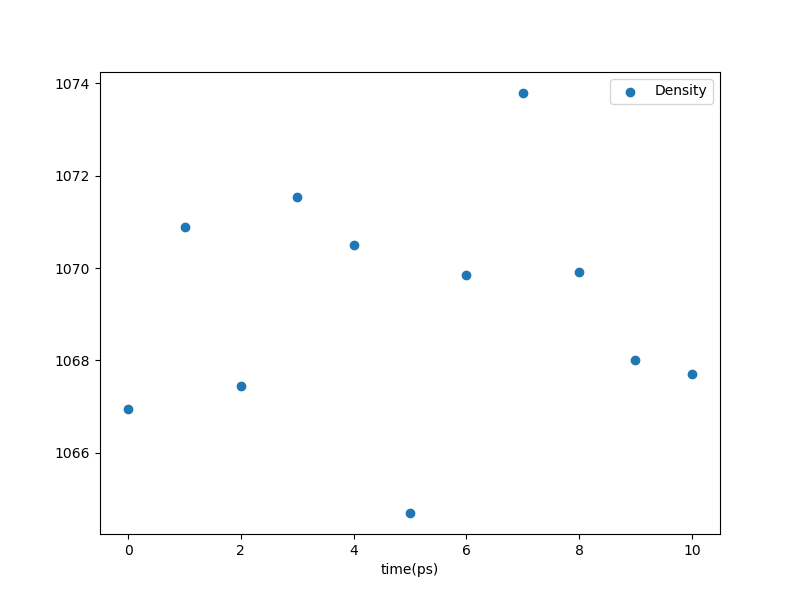

.. _tutorials_postsim_analyses:

Examples Using ``htpolynet postsim`` and ``analyze``
====================================================

Here, we will return to the DGEBA/PACM build we did in the earlier tutorials.  Let us do the following: 

1. Using the final results of the build as inputs, anneal the system for two cycles of heating and cooling between 300 and 600 K, using 10 ps rise-times and 10 ps hold-times.
2. Equilibrate at 300 K for an additional 10 ps.
3. Perform temperature ladder up to 600 K at 5 K per 100 ps, beginning with a 10 ps warmup.
4. Perform temperature ladder down to 300 K at 5 K per 100 ps, also beginning with a 10 ps warmup.
5. Using the result of 2, perform independent uniaxial deformations along the x, y, and z directions at a strain rate of 0.01 ps\ :sup:`-1` (10\ :sup:`10` s\ :sup:`-1`) to 0.1% strain.

The flowchart below illustrates:

.. figure:: pics/postsim-typical.png

Navigate into that base directory and create the file ``postsim.yaml`` with these contents:

.. code-block:: yaml

    - anneal:
        input_top: systems/final-results/final.top
        input_gro: systems/final-results/final.gro
        P: 1
        T0: 300
        T1: 600
        ncycles: 2
        T0_to_T1_ps: 10
        T1_ps: 10
        T1_to_T0_ps: 10
        T0_ps: 10
    - equilibrate:
        input_top: systems/final-results/final.top
        input_gro: postsim/anneal/anneal.gro
        T: 300
        ps: 10
    - ladder:
        input_top: systems/final-results/final.top
        input_gro: postsim/equilibrate/equilibrate.gro
        subdir: postsim/ladder-heat
        Tlo: 300
        Thi: 600
        deltaT: 5
        ps_per_rise: 10
        ps_per_run: 90
        warmup_ps: 10 
    - ladder:
        input_top: systems/final-results/final.top
        input_gro: postsim/ladder-heat/ladder.gro
        subdir: postsim/ladder-cool
        Tlo: 300
        Thi: 600
        deltaT: -5
        ps_per_rise: 10
        ps_per_run: 90
        warmup_ps: 10 
    - deform:
        input_top: systems/final-results/final.top
        input_gro: postsim/equilibrate/equilibrate.gro
        subdir: postsim/deform-x
        T: 300
        P: 1
        direction: x
        edot: 0.001
        ps: 10
        gromacs:
          gmx: gmx
          mdrun: gmx mdrun -ntmpi 1
          options: -quiet -nobackup
    - deform:
        input_top: systems/final-results/final.top
        input_gro: postsim/equilibrate/equilibrate.gro
        subdir: postsim/deform-y
        T: 300
        P: 1
        direction: y
        edot: 0.001
        ps: 10
        gromacs:
          gmx: gmx
          mdrun: gmx mdrun -ntmpi 1
          options: -quiet -nobackup
    - deform:
        input_top: systems/final-results/final.top
        input_gro: postsim/equilibrate/equilibrate.gro
        subdir: postsim/deform-z
        T: 300
        P: 1
        direction: z
        edot: 0.001
        ps: 10
        gromacs:
          gmx: gmx
          mdrun: gmx mdrun -ntmpi 1
          options: -quiet -nobackup

This file will instruct HTPolyNet to use Gromacs to conduct several MD simulations.  First, the final results of the build are annealed for two cycles between 300 and 600 K.  Then the result of the annealing is equilibrated at 300 K.  Following, both an increasing and then decreasing temperature ladders are run; in parallel (using the equilibrated output), three uniaxial deformations are run.

*Important disclaimer*:  Although ``htpolynet postsim`` is meant to facilitate production-grade MD simulations, those illustrated here are NOT; they are WAY TOO SHORT.  It is your responsibility to determine how long a simulation is needed for each kind of simulation.

Now, we can launch these simulations using

.. code-block:: bash

    $ htpolynet postsim -cfg postsim.yaml -ocfg DGEPAC.yaml -proj proj-0

*Important note*: Because these runs are ridiculously short for illustration purposes, it is not unreasonable to put all their ``postsim`` directives in one long file.  However, if one imagines requiring several hours of supercomputer time to do each one, it makes sense to split them into separate files and submit a series of batch jobs.

The result of this action is first that the ``postsim`` directory is added to the project directory, with ``anneal``, ``equilibrate``, ``ladder-heat``, and ``ladder-cool`` subdirectories:

.. code-block:: console

    .
    ├── lib
    │   └── molecules
    │       ├── inputs
    │       └── parameterized
    └── proj-0
        ├── molecules
        │   └── parameterized
        ├── plots
        ├── postsim
        │   ├── anneal
        │   ├── equilibrate
        │   ├── ladder-cool
        │   └── ladder-heat
        └── systems
            ├── capping
            ├── densification
            ├── final-results
            ├── init
            ├── iter-1
            ├── iter-10
            ├── iter-11
            .
            .
            .
            ├── postcure
            └── precure

If we look inside the ``anneal`` subdirectory, we see several files:

.. code-block:: console

    proj-0/postsim/anneal/
    ├── anneal.cpt
    ├── anneal.csv
    ├── anneal.edr
    ├── anneal.gro
    ├── anneal.log
    ├── anneal.tpr
    ├── anneal.trr
    ├── final.gro
    ├── final.grx
    ├── final.top
    ├── local.mdp
    ├── mdout.mdp
    └── rho_v_ns.png

The ``final`` files were copied directly from the ``systems/final-results`` directory, and the ``anneal`` files are the result of the run.  If we look inside ``mdout.mdp``, we can see in particular the lines that control the heating:

.. code-block:: console

    .
    .
    .
    dt                       = 0.002
    nsteps                   = 40000
    .
    .
    .
    ; SIMULATED ANNEALING  
    ; Type of annealing for each temperature group (no/single/periodic)
    annealing                = periodic
    ; Number of time points to use for specifying annealing in each group
    annealing-npoints        = 5
    ; List of times at the annealing points for each group
    annealing-time           = 0.0 10.0 20.0 30.0 40.0
    ; Temp. at each annealing point, for each group.
    annealing-temp           = 300 600 600 300 300
    .
    .
    .

A quick look at the plot of density vs. time that was generated on the fly:

.. figure:: pics/rho_v_ns.png

    Density vs. time in the annealing stage.

This shows that two cycles were done, but unfortunately, we see that intention of the annealing was not met -- the density did not increase as a result; in fact, it looks like it decreased.  AGAIN: this are stupidly short simulations just for illustration.

Below is an example of an analogous plot from a production simulation:

.. figure:: pics/prod-rho_v_ns.png

    Density vs. time in the annealing stage of a production MD simulation.

In this case, the much longer annealing did in fact increase the system density, as intended.  This is a three-cycle anneal lasting a total of 120 ns.

The equilibration stage also produces such a plot:

    Density vs. time in the equilibration stage.

This is a silly plot, since the equilibration is so short.  An example of an analogous post-anneal equilibration (from the same example as above) is this one:

    Density vs. time in the equilibration stage of the production MD simulation.

That equilibration lasted 100 ns and resulted in a significant densification.  This type of plot is important since it reveals a transient in the first 60% or so of the simulation, meaning that equilibrium measurements should be averages over only the last 40 ns or so of the trajectory.

Now, with a single invocation of ``htpolynet plots``, we can compute T\ :sub:`g` and E.

.. code-block:: bash

    $ htpolynet plots post --cfg postsim.yaml --proj proj-0
    INFO>                                                                    
    INFO>     HTPolyNet 1.0.6                                                
    INFO>     https://abramsgroup.github.io/HTPolyNet/                       
    INFO>                                                                    
    INFO>     Ming Huang                                                     
    INFO>     mh3429@dragons.drexel.edu                                      
    INFO>                                                                    
    INFO>     Cameron F. Abrams                                              
    INFO>     cfa22@drexel.edu                                               
    INFO>                                                                    
    INFO>     Supported in part by Grants W911NF-17-2-0227                   
    INFO>     and W911NF-12-R-0011 from the US Army Research Lab             
    INFO>                                                                    
    INFO> anneal-equilibrate-ladder-ladder-deform-deform-deform-density.png created.
    INFO> mean density 1069 kg/m^3 (1.069 g/cc)
    INFO> ladder0-data.csv created.
    INFO> ladder1-data.csv created.
    INFO> tg.png created.
    INFO> heating Tg = 394.91 K (121.76 C) at 0.05000 K/ps (5.000e+10 K/s)
    INFO> cooling Tg = 451.03 K (177.88 C) at -0.05000 K/ps (-5.000e+10 K/s)
    /home/cfa/anaconda3/envs/mol-env/lib/python3.10/site-packages/scipy/optimize/_minpack_py.py:906: OptimizeWarning: Covariance of the parameters could not be estimated
    warnings.warn('Covariance of the parameters could not be estimated',
    /home/cfa/Git/HTPolyNet/HTPolyNet/utils.py:404: RuntimeWarning: invalid value encountered in scalar divide
    r2=1-sse.sum()/sst.sum()
    INFO> e.png and E.csv created. E = 7.120 GPa (R^2 nan)

We see the troubling result that T\ :sub:`g` is different between the heating and cooling ladders; this of course is because these AGAIN ARE VERY SHORT simulations. This also generates a nice plot:

    Density vs. temperature in the heating (left) and cooling (right) simulations in this example.

In practice, we should run much longer simulations and average over replicas.  Below is the analogous plot for a production MD simulation:

.. figure:: pics/prod-tg.png

    Density vs. temperature in the heating (left) and cooling (right) simulations in production simulations, averaged over five replicas, with a heating rate of 5 K per 100 ns.

We also note a ridiculous value for the Young's modulus of 7.1 GPa.  The plot of stress vs strain shows this is meaningless from such a short simulation:

    Stress vs. strain, averaged over deformations along x, y, and z, for our short simulation.

Again, in practice, this should be the result of much longer simulations and averaging over replicas.  If done correctly, we see something like this:

    Stress vs. strain, averaged over deformations along x, y, and z, and over five replicas and a strain rate of 10\ :sup:`8` s\ :sup:`-1`. 

Finally, let's use ``analyze`` to measure fractional free volume in the equilibration stage.  Using the shortcut approach, we need an input YAML file ``fv.yaml`` that just has one line:

.. code-block:: yaml

    - command: freevolume

Then

.. code-block:: console

    $ htpolynet analyze -cfg fv.yaml -proj proj-0

So we can look at ``analyze/freevolume/ffv.dat``:abbr:

.. code-block:: console

    Free volume 37.82 +/- 0.15 %
    Total volume 138.40 +/- 0.33 nm^3
    Number of molecules 1 total mass 89116.20 Dalton
    Average molar mass: 89116.20 Dalton
    Density rho: 1069.20 +/- 19.54 nm^3
    Molecular volume Vm assuming homogeneity: 138.4034 +/- 0.3274 nm^3
    Molecular van der Waals volume assuming homogeneity:  86.0656 +/- 0.0000 nm^3
    Fractional free volume 0.192 +/- 0.001

If we wanted to perform this on the production example, we would probably like to begin at 60,000 ps or so:

.. code-block:: yaml

    - command: freevolume
      options:
        b: 60000

