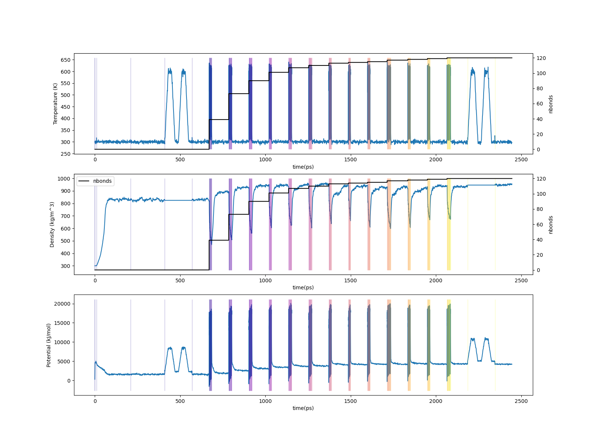

.. _pms_results:

Results
-------

Overall behavior
^^^^^^^^^^^^^^^^

Using ``htpolynet plots`` we can generate a few interesting graphics that help characterize a build.  In this tutorial, we generated a 95%-cure build under ``proj-0``, with diagnostic output in ``diagnostics.log`` and console output to ``console.log``.  

As an exercise, copy ``pMSTY.yaml`` to ``pMSTY-low.yaml`` and in it, change the desired cure to 0.50 instead of 0.95.  Then launch a second build:

.. code-block:: bash

    $ htpolynet run -diag diagnostics-low.log pMSTY-low.yaml &> console-low.log

This will populate the project directory ``proj-1`` (whose name is automatically assigned).  Once it completes, we can generate some plots.

First, we can make plots of the conversion vs. run time and the cure iteration vs. run time:

.. code-block:: console

    $ htpolynet plots diag --diags diagnostics.log diagnostics-low.log

This generates ``cure_info.png``: 

.. figure:: pics/cure_info.png

    (Left) Conversion vs. wall-clock time; (right) Iteration number vs wall-clock time.

We can see here that the 95\% cure took about 8 and a half minutes of run time (which is not really impressive since this is a **very** small system).  Fully two-thirds of the run time is consumed realizing the final 15\% of the cure.

Second, we can make plots that track the temperature, density, and potential energy throughout the entire build process:

.. code-block:: console

    $ htpolynet plots build --proj proj-0 --buildplot t --traces t d p

This command extracts temperature, density, and potential energy from all Gromacs ``edr`` output files in ``proj-0/`` in the order they were generated, plots them according to a default format, and stores the extracted data in a ``csv`` file.  By default, the plot is in ``proj-0/buildtraces.png`` and the corresponding data in ``proj-0/buildtraces.csv``.

    (Top) Temperature vs. run time; (middle) Density vs. run time; (bottom) Potential energy vs. run time.  In all panels, vertical lines designate initiations of Gromacs simulations.

From these traces, we can see how little MD time is actually devoted to forming the bonds as compared to relaxing both before and after.  The top plot shows temperature in K vs. time in ps througout the build process.  Vertical lines denote transitions from one step to the next; transitions are very close together in time during the CURE iterations since I'm showing one transition for each drag/relax stage.  The middle plot shows the density trace' note how the density begins at the stipulated low value of 300 kg/m3\ :sup:`3`\.  The bottom plot shows the potential energy trace.

In the figure below, we show two renderings of this system.  In each, all bonds between C1 and C2 atoms are shown as grey tubes, and all other bonds are colored by individual unique monomer and made transparent.  On the left is the system just after the precure anneal, where you can see that only **intramolecular** C1 and C2 bonds exist.  On the right is the system after postcure, where you can see chains of -C1-C2- bonds.

.. list-table:: 

    * - .. figure:: pics/hi-pre.png

           Methystyrene liquid before cure.

      - .. figure:: pics/hi.png

           Poly(methyl styrene) after 95% cure.

Details
^^^^^^^

The ``htpolynet run`` invocation in ``run.sh`` runs a high-cure build (95\% conversion) in the ``proj-0`` subdirectory, generating and populating the following directory structure:

.. code-block:: console

    $ cd proj-0
    $ tree -d .
    .
    ├── lib
    │   └── molecules
    │       ├── inputs
    │       └── parameterized
    └── proj-0
        ├── molecules
        │   └── parameterized
        ├── plots
        └── systems
            ├── capping
            ├── densification
            ├── final-results
            ├── init
            ├── iter-1
            ├── iter-10
            ├── iter-11
            ├── iter-12
            ├── iter-13
            ├── iter-2
            ├── iter-3
            ├── iter-4
            ├── iter-5
            ├── iter-6
            ├── iter-7
            ├── iter-8
            ├── iter-9
            ├── postcure
            └── precure

There are three main subdirectories in all project directories:

* ``molecules/``: This directory has one subdirectory, ``molecules/parameterized`` that contains all files associated with generation and parameterization of all molecules and oligomer templates.  The important files here are those with ``gro``, ``top``, ``itr``, and ``grx`` extensions.

* ``systems/``:  This directory contains all directories where Gromacs runs are conducted.

* ``plots/``: This directory contains some plots generated on the fly.

``proj-0/systems``
~~~~~~~~~~~~~~~~~~

The ``init/`` directory is where the initial topology and coordinates are generated.

.. code-block:: console

    $ ls systems/init
    EMB.gro  init.gro  init.grx  init.top

Then in ``densification`` are the files associated with the MD simulations used to densify the initial system.

.. code-block:: console

    $ ls systems/densification
    densified-min.edr  densified-npt.edr  densified-nvt.edr  init.grx
    densified-min.gro  densified-npt.gro  densified-nvt.gro  init.top
    densified-min.log  densified-npt.log  densified-nvt.log  mdout.mdp
    densified-min.mdp  densified-npt.mdp  densified-nvt.mdp  min.mdp
    densified-min.tpr  densified-npt.tpr  densified-nvt.tpr  npt.mdp
    densified-min.trr  densified-npt.trr  densified-nvt.trr  nvt.mdp
    densified-npt.cpt  densified-nvt.cpt  init.gro

The files with ``init`` basenames are copied from the ``systems/init`` directory.  You can note output from three separate Gromacs ``mdrun`` invocations: 1. a minimization; 2. an NVT equilibration, and 3. an NPT equilibration.

Next comes the ``precure`` directory, which contains all the results of the precure equilibrations and annealing (if requested).  

.. code-block:: console

    $ ls systems/precure
    annealed.cpt               postequilibration-npt.edr
    annealed.edr               postequilibration-npt.gro
    annealed.gro               postequilibration-npt.log
    annealed.log               postequilibration-npt.mdp
    annealed.tpr               postequilibration-npt.tpr
    annealed.trr               postequilibration-npt.trr
    densified-npt.gro          preequilibration-npt.cpt
    init.grx                   preequilibration-npt.edr
    init.top                   preequilibration-npt.gro
    mdout.mdp                  preequilibration-npt.log
    npt.mdp                    preequilibration-npt.mdp
    nvt.mdp                    preequilibration-npt.tpr
    postequilibration-npt.cpt  preequilibration-npt.trr

Here, ``init.top`` and ``init.grx`` are copied from ``systems/densification``, as is coordinate file ``densified-npt.gro``.  These are input to the pre-annealing equilibration (``preequilibration-npt.*``), which then serves as input to the annealing simulation (``annealed.*``), which in turn serves as input to the post-annealing equilibration (``postequilibration-npt.*``).

Next come the iteration directories; here, thirteen CURE iterations were run.  Below we show just a listing of the ``iter-1`` directory.

.. code-block:: console

    $ ls systems/iter-1
    0-cure_bondsearch-bonds.csv   3-cure_relax-stage-1-nvt.tpr  3-cure_relax-stage-3-min.log  3-cure_relax-stage-4-npt.gro  3-cure_relax-stage-5-nvt.edr
    2-cure_update-bonds.csv       3-cure_relax-stage-1-nvt.trr  3-cure_relax-stage-3-min.tpr  3-cure_relax-stage-4-npt.log  3-cure_relax-stage-5-nvt.gro
    2-cure_update.gro             3-cure_relax-stage-1.top      3-cure_relax-stage-3-min.trr  3-cure_relax-stage-4-npt.tpr  3-cure_relax-stage-5-nvt.log
    2-cure_update.grx             3-cure_relax-stage-2-min.edr  3-cure_relax-stage-3-npt.cpt  3-cure_relax-stage-4-npt.trr  3-cure_relax-stage-5-nvt.tpr
    2-cure_update-idx-mapper.csv  3-cure_relax-stage-2-min.gro  3-cure_relax-stage-3-npt.edr  3-cure_relax-stage-4-nvt.cpt  3-cure_relax-stage-5-nvt.trr
    2-cure_update.top             3-cure_relax-stage-2-min.log  3-cure_relax-stage-3-npt.gro  3-cure_relax-stage-4-nvt.edr  3-cure_relax-stage-5.top
    3-cure_relax-complete.top     3-cure_relax-stage-2-min.tpr  3-cure_relax-stage-3-npt.log  3-cure_relax-stage-4-nvt.gro  4-cure_equilibrate-npt.cpt
    3-cure_relax-relax-bonds.csv  3-cure_relax-stage-2-min.trr  3-cure_relax-stage-3-npt.tpr  3-cure_relax-stage-4-nvt.log  4-cure_equilibrate-npt.edr
    3-cure_relax-stage-1-min.edr  3-cure_relax-stage-2-npt.cpt  3-cure_relax-stage-3-npt.trr  3-cure_relax-stage-4-nvt.tpr  4-cure_equilibrate-npt.gro
    3-cure_relax-stage-1-min.gro  3-cure_relax-stage-2-npt.edr  3-cure_relax-stage-3-nvt.cpt  3-cure_relax-stage-4-nvt.trr  4-cure_equilibrate-npt.log
    3-cure_relax-stage-1-min.log  3-cure_relax-stage-2-npt.gro  3-cure_relax-stage-3-nvt.edr  3-cure_relax-stage-4.top      4-cure_equilibrate-npt.mdp
    3-cure_relax-stage-1-min.tpr  3-cure_relax-stage-2-npt.log  3-cure_relax-stage-3-nvt.gro  3-cure_relax-stage-5-min.edr  4-cure_equilibrate-npt.tpr
    3-cure_relax-stage-1-min.trr  3-cure_relax-stage-2-npt.tpr  3-cure_relax-stage-3-nvt.log  3-cure_relax-stage-5-min.gro  4-cure_equilibrate-npt.trr
    3-cure_relax-stage-1-npt.cpt  3-cure_relax-stage-2-npt.trr  3-cure_relax-stage-3-nvt.tpr  3-cure_relax-stage-5-min.log  init.grx
    3-cure_relax-stage-1-npt.edr  3-cure_relax-stage-2-nvt.cpt  3-cure_relax-stage-3-nvt.trr  3-cure_relax-stage-5-min.tpr  init.top
    3-cure_relax-stage-1-npt.gro  3-cure_relax-stage-2-nvt.edr  3-cure_relax-stage-3.top      3-cure_relax-stage-5-min.trr  linkcell-0.50.grx
    3-cure_relax-stage-1-npt.log  3-cure_relax-stage-2-nvt.gro  3-cure_relax-stage-4-min.edr  3-cure_relax-stage-5-npt.cpt  mdout.mdp
    3-cure_relax-stage-1-npt.tpr  3-cure_relax-stage-2-nvt.log  3-cure_relax-stage-4-min.gro  3-cure_relax-stage-5-npt.edr  npt.mdp
    3-cure_relax-stage-1-npt.trr  3-cure_relax-stage-2-nvt.tpr  3-cure_relax-stage-4-min.log  3-cure_relax-stage-5-npt.gro  postequilibration-npt.gro
    3-cure_relax-stage-1-nvt.cpt  3-cure_relax-stage-2-nvt.trr  3-cure_relax-stage-4-min.tpr  3-cure_relax-stage-5-npt.log  relax-min.mdp
    3-cure_relax-stage-1-nvt.edr  3-cure_relax-stage-2.top      3-cure_relax-stage-4-min.trr  3-cure_relax-stage-5-npt.tpr  relax-npt.mdp
    3-cure_relax-stage-1-nvt.gro  3-cure_relax-stage-3-min.edr  3-cure_relax-stage-4-npt.cpt  3-cure_relax-stage-5-npt.trr  relax-nvt.mdp
    3-cure_relax-stage-1-nvt.log  3-cure_relax-stage-3-min.gro  3-cure_relax-stage-4-npt.edr  3-cure_relax-stage-5-nvt.cpt

Files in iteration directories are prepended with a number that corresponds to their order.  Here we have files that begin with 0, 2, and 3.  "0" refers to the initial search for possible bonds; these are reported in the ``csv`` file.  "1" (which is missing here) refers to pre-bond dragging; since no new bonds were longer than 0.8 nm, pre-bond dragging was not triggered.  "2" refers to the generation of the new bonded topology.  "3" refers to post-bond-formation relaxation to allow new bonds to relax to their equilibrium lengths.  These relaxations progress through five iterations of minimization-NVT-NPT simulations to relax the new bonds.

Some CURE iterations may require pre-bond dragging.  In the system I ran to generate this documentation, no cases of prebond dragging were required.

Then comes the ``capping`` directory where the final topology updates are performed to cap any unreacted monomers (reverting them from their "active" forms to their "proper" forms).  In this run, this directory is empty, since no unreacted monomers exist at the end of the CURE.

Then comes ``postcure`` equilibration and relaxation.  

.. code-block:: console

    $ ls systems/postcure
    2-cure_update.grx           npt.mdp
    3-cure_relax-complete.top   nvt.mdp
    4-cure_equilibrate-npt.gro  postequilibration-npt.cpt
    annealed.cpt                postequilibration-npt.edr
    annealed.edr                postequilibration-npt.gro
    annealed.gro                postequilibration-npt.log
    annealed.log                postequilibration-npt.mdp
    annealed.tpr                postequilibration-npt.tpr
    annealed.trr                postequilibration-npt.trr
    mdout.mdp

The files beginning with digits are copied either from the last ``iter`` directory or the ``capping`` directory (here, since no capping was necessary, they came from ``iter-13``).  As stipulated in the configuration file, we first run annealing, and then a post-annealing NPT equilibration.  

Finally, HTPolyNet copies the results of the postcure, with new file names, into ``final-results``.

.. code-block:: console

    $ ls final-results
    final.gro  final.grx  final.top

Here we see the ``top``, ``gro``, and ``grx`` files of the final system; the ``top`` and ``gro`` files can be used right away for Gromacs MD simulations.

``proj-0/plots``
~~~~~~~~~~~~~~~~

``HTPolyNet`` generates several plots on the fly during a system build.  

.. code-block:: console

    $ ls plots
    densification-density.png
    iter-10-cure_equilibrate-density.png
    iter-11-cure_equilibrate-density.png
    iter-12-cure_equilibrate-density.png
    iter-13-cure_equilibrate-density.png
    iter-1-cure_equilibrate-density.png
    iter-2-cure_equilibrate-density.png
    iter-3-cure_equilibrate-density.png
    iter-4-cure_equilibrate-density.png
    iter-5-cure_equilibrate-density.png
    iter-6-cure_equilibrate-density.png
    iter-7-cure_equilibrate-density.png
    iter-8-cure_equilibrate-density.png
    iter-9-cure_equilibrate-density.png
    postcure-anneal-T.png
    postcure-postequilibration-density.png
    precure-anneal-T.png
    precure-postequilibration-density.png
    precure-preequilibration-density.png
    reaction_network.png

For example, ``densification-density.png`` indicates that the densification simulation was in fact able to densify the system:

.. figure:: pics/densification-density.png

    ``densification-density.png`` for the high-cure build of polymethylstyrene.

We can check that the annealing cycles were correctly performed from ``precure-anneal-T.png`` ``postcure-anneal-T.png``:

.. list-table:: 

    * - .. figure:: pics/precure-anneal-T.png

           Temperature during pre-cure annealing.

      - .. figure:: pics/postcure-anneal-T.png

           Temperature during post-cure annealing.

Finally, we can take a look at the density after the postcure-anneal in ``postcure-postequilibration-density.png``:

.. figure:: pics/postcure-postequilibration-density.png 

    ``postcure-postequilibration-density.png``

    Density during post-cure annealing of the 95% cured system.

Note that the final equilibrated density is about 950 kg/m\ :sup:`3`\ at 300 K and 1 bar, quite a bit higher than the density of about 800 kb/m^3 liquid styrene at 10 bar and 300 K from the densification simulations.  This result is outside the range expected for `poly(4-methyl styrene) <https://polymerdatabase.com/polymers/poly4-methylstyrene.html>`_ of about 1.01 g/cc, but it's not too suprising given that this is a very small system with a low molecular weight, and it was not very extensively equilibrated. 