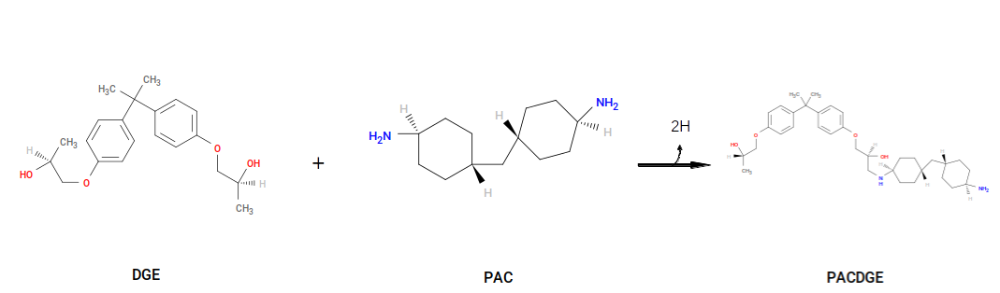
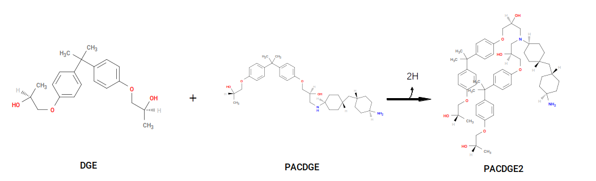

.. _dgeba_reaction_dictionaries:

Reactions
=========

In a system of diepoxies and diamines, the two distinct crosslinking reactions are 

1. Reaction of an epoxy with a primary amine to generate a secondary amine; and
2. Reaction of an epoxy with a secondary amine to generate a tertiary amine.

In the case of PACM and DGEBA, these can be represented as

The first reaction generates a product we call "PAC~N1-C1~DGE", and the second reaction uses PACDGE as a reactant, along with DGE, to make "PAC~N1-C1~DGE-C1~DGE". Note that both result in deletion of two "sacrificial hydrogens". PAC~N1-C1~DGE serves as a parameterization template for new primary amines, and PAC~N1-C1~DGE-C1~DGE serves as a parameterization template for new secondary amines.  That is, upon formation of a new secondary amine, the system acquires new bonded interactions, atoms types, and partial charges, based on those in the template that are contiguous with the new bond and new bonded interactions.

To allow for specification of general reactions, HTPolyNet parses a standard YAML syntax called a "reaction directive".  Here is the reaction directive for the first reaction:

.. code-block:: yaml

  - name:        'Primary-to-secondary-amine'
    stage:       cure
    reactants:
      1: PAC
      2: DGE
    product:     PAC~N1-C1~DGE
    probability: 1.0
    atoms:
      A: 
        reactant: 1
        resid: 1
        atom: N1
        z: 2
      B:
        reactant: 2
        resid: 1
        atom: C1
        z: 1
    bonds:
      - atoms: [A, B]
        order: 1

Like all YAML, these are keyword:value pairs.  The subdirective ``name`` is just a label; you can use any meaningful string here.  The subdirective ``stage`` is either ``cure`` or ``cap``; we'll see an example of a capping reaction below.  The subdirective ``reactants`` labels the reactants with internal keys (here, ``1`` and ``2``), and the values ``PAC`` and ``DGE`` imply the existence of ``PAC.mol2`` (or ``PAC.pdb``) and ``DGE.mol2`` (or ``DGE.pdb``) in the local library.  The subdirective ``product`` names the product molecule.  The subdirective ``probability`` is a number between 0 or 1 that governs the likelihood of the bond forming in any given iteration; that is, each bond matching this template that has passed all other single-bond and global filters is only allowed to form if its intrinsic probability is greater than a random number drawn between 0 and 1.  A probability of 1.0 implies matching bonds will always form.  The subdirective ``atoms`` labels all atoms participating in the reaction, and we generally expect at least two atoms, one from each reactant.  Here, we label the N1 atom of PAC as atom ``A`` and the C1 atom of DGE as ``B``.  (We'll refer to these labels in just a minute.)  Notice that we reference PAC as "residue 1 of reactant 1", and we insist that the N1 atom have **two** available crosslink sites (``z`` is 2), and we reference DGE as "residue 1 of reactant 2", with a ``z`` of 1.  Finally, the subdirective ``bonds`` is a list of bond directive.  Each bond directive has two items: ``atoms`` is the list of the two atoms (referenced according to their keys in the ``atoms`` dict) that form the bond, and ``order`` is the bond order.

Now, let's consider the reaction directive for the conversion of a secondary amine to a tertiary amine:

.. code-block:: yaml

  - name:        'Secondary-to-tertiary-amine'
    reactants:
      1: PAC~N1-C1~DGE
      2: DGE
    product:     PAC~N1-C1~DGE-C1~DGE
    stage:       cure
    probability: 0.5
    atoms:
      A:
        reactant: 1
        resid: 1
        atom: N1
        z: 1
      B:
        reactant: 2
        resid: 1
        atom: C1
        z: 1
    bonds:
      - atoms: [A, B]
        order: 1

Notice carefully the new reactant 1 here is PAC~N1-C1~DGE, and atom A is the N1 of residue 1 of reactant 1 with a ``z`` of 1.  This reaction generates the product PAC~N1-C1~DGE-C1~DGE.  We also set its probability to 0.5, which is approximately the same as saying these reactions intrisically happen with half the frequency of the secondary-amine-formation reactions.  This allows a way to specify the "relative reactivity" of the two types of reactions. (Typically, secondary-to-tertiary amine reactions are slower than analogous primary-to-secondary amine reactions.)

Finally, "capping" reactions that get rid of "extra" sacrificial hydrogens can be defined.  Consider:

.. image:: pics/r3.png

This reaction removes the two sacrificial H's used to "open" the oxirane and reforms the oxirane.  The YAML syntax for this reaction is

.. code-block:: yaml

  - name:        'Oxirane-formation'
    reactants:
      1: DGE
    product:     DGEC
    stage:       cap
    probability: 1.0
    atoms:
      A:
        reactant: 1
        resid: 1
        atom: O1
        z: 1
      B:
        reactant: 1
        resid: 1
        atom: C1
        z: 1
    bonds:
      - atoms: [A, B]
        order: 1

With these reaction dictionaries defined, we are ready to create the :ref:`configuration file <dgeba_configuration_file>`.