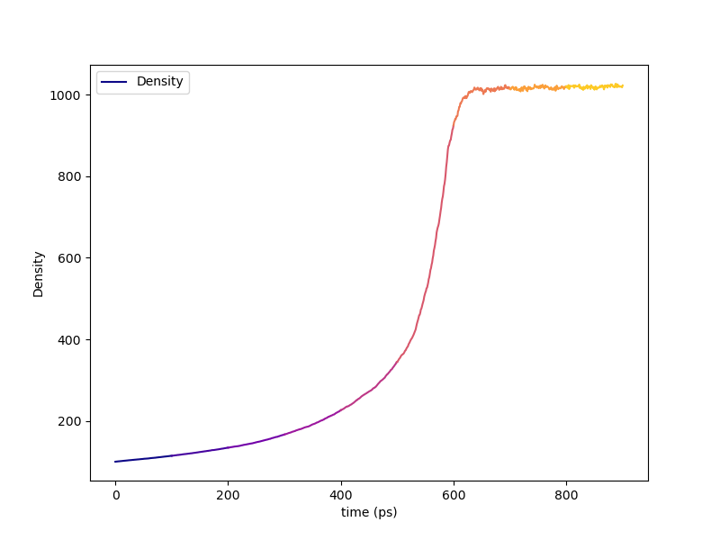
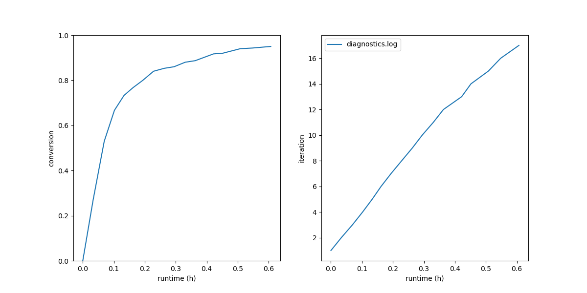
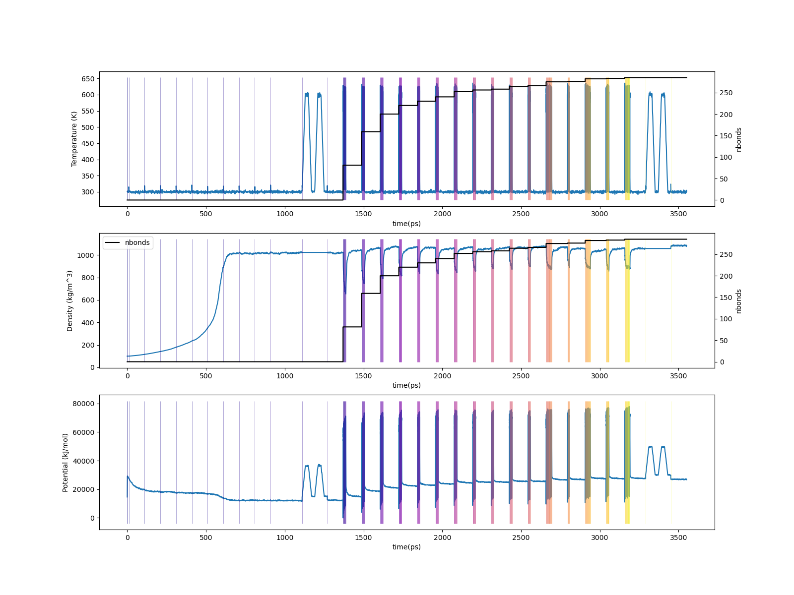

.. _ve_results:

Results
=======

The :ref:`results section of the PMS tutorial <pms_results>` does a good job walking you through the project directory structure for any ``HTPolyNet`` run, so we'll skip that here.  

First, if we look in ``proj-0/plots``, we can see the density vs. time of the densification stage:

    Density vs. time during the densification stage of the bisGMA/STY liquid.  Each of the nine distinct simulations in series is colored uniquely along a ``matplotlib`` ``plasma`` colomap.

As in the polymethylstyrene tutorial, we can make plots of the conversion vs. run time and the cure iteration vs. run time:

.. code-block:: console

    $ htpolynet plots diag --diags diagnostics.log

With fewer atoms than the DGEBA/PACM tutorial, and fewer iterations needed to reach 95% conversion, it is not surprising this build took only an hour or so.  Again, we see that the first 25% or so of the run time gets 75% or so of the way to cured.

Let's generate traces of temperature, density, and potential energy vs time for the entire course of the system build:

.. code-block:: console

    $ htpolynet plots build --proj proj-0 --buildplot t --traces t d p
    
This command will read all ``edr`` files in order to construct the overall traces.  This will take a few minutes.

    (Top) Temperature vs. time for 95% cure of bisGMA/STY (Middle) Density vs time.  The two topmost plots also report number of bonds; (Bottom) Potential energy vs. time.

Below we show before and after pictures of the system, where all bonds associated with crosslink sites are rendered in "licorice" with the rest in lines, and GMA molecules are mauve while STYs are green:

.. list-table:: 

    * - .. figure:: pics/gma-sty-liq.png

           System before cure; C1-C2 bonds within each monomer are rendered in licorice.

      - .. figure:: pics/gma-sty-cured.png

           System after cure; all C1-C2 bonds (intra and intermolecular) are rendered in licorice.