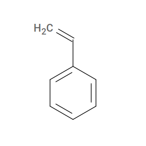
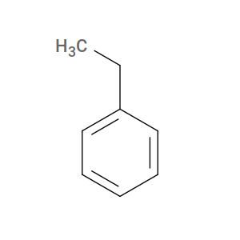

.. _molecular_structure_inputs:

Molecular Structure Inputs
--------------------------

``HTPolyNet`` requires molecular structures in order to generate systems.  It recognizes ``mol2`` and ``pdb`` format files, and it is up to you to make these for your system.  Any ``mol2`` or ``pdb`` file you wish to use as a monomer template should be in the `./lib/molecules/inputs/` relative to the current directory in which you issue ``htpolynet run`` or ``htpolynet parameterize``.  There are several ways to make such files from other (e.g., 2-dimensional) structural information, and we will cover two here.  There are also two **very important** things to keep in mind when generating your molecular structure files.

The first **very important** thing is this:  ``HTPolyNet`` requires **valence-conservation** when polymerizing.  This means that when two atoms are identified as bonding partners (each of which is on a separate molecule, most likely), they each must own at least one **sacrificial hydrogen** atom that is deleted when the bond is formed, thus keeping the valence of each atom constant.  We refer to the **valence-conserving** form of a monomer as its **active** form.  

To illustrate how to handle this, let's consider the simple monomer styrene.  The "inactive" form of styrene is its "actual" structure:

However, for ``HTPolyNet``, styrene's **active** form is actually ethylbenzene:

So we need to generate a ``mol2`` and/or ``pdb`` file for an ethylbenzene to use styrene as a monomer in ``HTPolyNet``.

One way to generate ``mol2`` files is with any one of a number of chemical "sketching" tools.  For example, the `ChemDoodle 2D sketcher <https://web.chemdoodle.com/demos/2d-sketcher>`_:

.. figure:: chemdoodle-2dsketcher-emb.png

    Example of a Chemdoodle 2d-sketcher session for creating an input ``mol2`` file for styrene (ahem, actually ethylbenzene).

Another way is to use `OpenBabel <https://openbabel.org/wiki/Main_Page>`_'s ``obabel`` command.  For example, we can use the `SMILES string <https://en.wikipedia.org/wiki/Simplified_molecular-input_line-entry_system>`_ for ethylbenzene to tell ``openbabel`` to generate 3-D coordinates and save to a ``mol2`` (or, alternatively, a ``pdb``) file:

.. code-block:: console

    $ obabel -:"C1=CC=CC=C1CC" -ismi --gen-3d -h -omol2 -O STY.mol2

SMILES is a really great way to describe molecular structures, and it makes monomer structure generation simply a matter of expressing it as a string and using ``obabel`` to generate coordinates.  

The second **very important** thing is that you must **edit** the ``mol2`` or ``pdb`` files for your monomers.  This is because ``HTPolyNet`` expects atoms that it must reference must have **unique names** in each type of monomer.  It doesn't matter so much what the names are, only that they are unique.  And not **all** atoms need to be uniquely named, only the ones that ``HTPolyNet`` needs in order to make bonds happen.  We will provide several examples of atom naming conventions in the :ref:`tutorials <example_tutorials>`.

