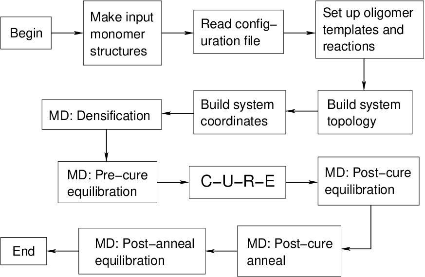

Program Flow
------------

   Highest-level ``HTPolyNet`` workflow.

``HTPolyNet``'s largest-scale workflow is shown in the figure above.  "MD" indicates steps that are *primarily* molecular dynamics.  The CURE algorithm (labelled "C-U-R-E") is shown as a single node 
in this workflow.  The first node, "Make input monomer structures" is not performed by ``HTPolyNet`` but is instead the responsibility of the user; we provide some general guidance :ref:`here <molecular_structure_inputs>` and some specific example cases in the :ref:`tutorials <example_tutorials>`.

Each of the major blocks in the workflow above have associated dictionaries of keyword:parameter values that can be provide in the :ref:`configuration file <configuration_files>`.

HTPolyNet produces Gromacs topology and coordinate files for amorphous, crosslinked polymer systems following the basic steps below.

1. *Read and parse* the configuration file and setup the project file system under the current working directory.
2. *Fetch* any existing parameterizations of monomers or templates from either (i) a local user library, or (ii) the system library.  If none are present, *perform the required GAFF-parameterization* of any input monomers to yield Gromacs-compatible input files, and build any intermediate molecules dictated by the polymerization chemistry and GAFF-parameterize those.  All such parameterizations are stored in `molecules/parameterized/` in the project file system. 
3. Based on a specified composition, generate an initial simulation box, and equilibrate it to a liquid-like density (i.e., densify it).  A plot of density vs. time is generated and stored in `plots/`.
4. Perform CURE (Connect-Update-Relax-Equilibrate) iterations to introduce intermonomer bonds according to the input chemistry until a desired conversion is met or an execution threshhold is reached.
5. Finalize by performing any requested post-cure chemistry.
6. MD equilibrate.

Steps 3 through 6 all involve invocations of Gromacs.  All `mdp` files needed appear in the `mdp/` directory of the system library (the Library subpackage).
